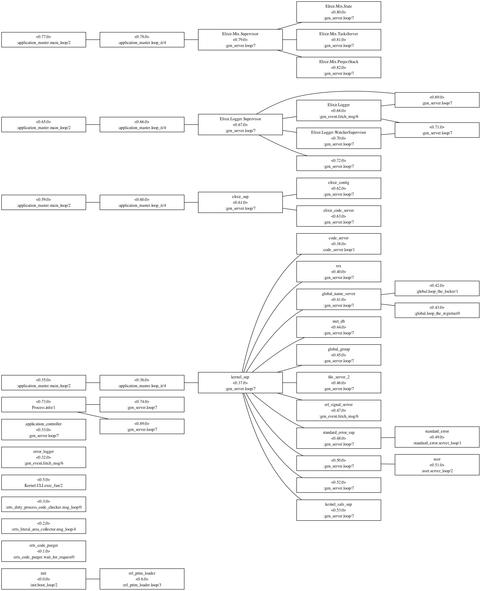

# ProcTree

Output processes tree as a [dot format file](https://en.wikipedia.org/wiki/DOT_(graph_description_language)).

```elixir
iex> ProcTree.save_procs_tree("procs.dot")
```

For example, convert a dot file to a image file with [Graphviz](http://graphviz.org)'s dot command.

```sh
$ dot procs.dot -Tpng -o procs.png
$ dot procs.dot -Tsvg -o procs.svg
```



## Installation

If [available in Hex](https://hex.pm/docs/publish), the package can be installed
by adding `proc_tree` to your list of dependencies in `mix.exs`:

```elixir
def deps do
  [
    {:proc_tree, github: "mattsan/proc_tree", only: :dev, runtme: false}
  ]
end
```

Documentation can be generated with [ExDoc](https://github.com/elixir-lang/ex_doc)
and published on [HexDocs](https://hexdocs.pm). Once published, the docs can
be found at [https://hexdocs.pm/proc_tree](https://hexdocs.pm/proc_tree).

